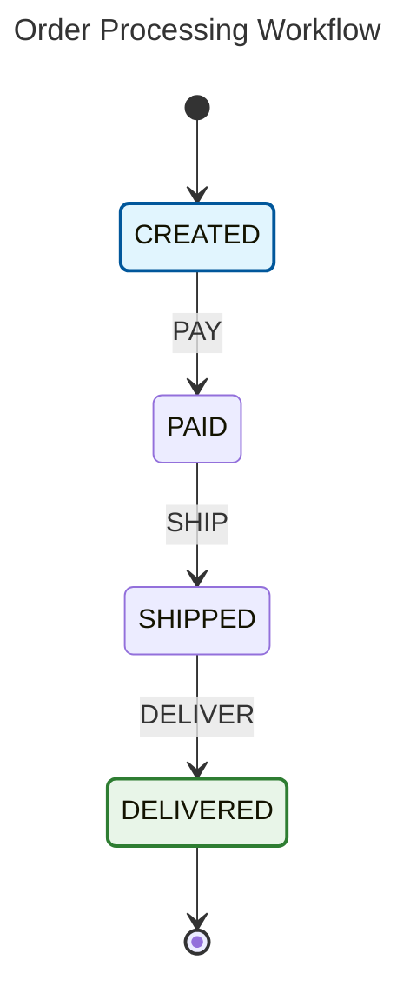
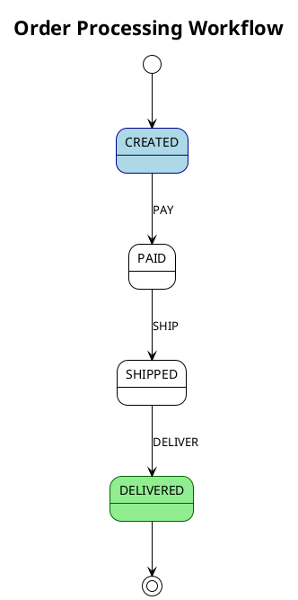

# 🚀 FlowMachine Core Documentation

[](https://jitpack.io/#rayenrejeb/flow-machine)
[](https://github.com/rayenrejeb/flow-machine/actions)
[](https://opensource.org/licenses/MIT)
[](https://www.oracle.com/java/)

**A "flow machine" library for Java that makes workflow management elegant and intuitive.**

## 📦 Installation

### Maven

Add the JitPack repository to your `pom.xml`:

```xml
<repositories>
    <repository>
        <id>jitpack.io</id>
        <url>https://jitpack.io</url>
    </repository>
</repositories>
```

Add the dependency:

```xml
<dependency>
    <groupId>com.github.rayenrejeb</groupId>
    <artifactId>flow-machine-core</artifactId>
    <version>Tag</version> <!-- Replace with latest version -->
</dependency>
```

### Gradle

Add JitPack repository to your `build.gradle`:

```gradle
repositories {
    maven { url 'https://jitpack.io' }
}
```

Add the dependency:

```gradle
dependencies {
    implementation 'com.github.rayenrejeb:flow-machine-core:Tag' // Replace with latest version
}
```

### Latest Version

Get the latest version from [JitPack releases](https://jitpack.io/#rayenrejeb/flow-machine).

## 📋 Table of Contents

- [Quick Start](#-quick-start)
- [Core Concepts](#-core-concepts)
- [Complete API Reference](#-complete-api-reference)
- [Advanced Features](#-advanced-features)
- [Visual Diagrams](#-visual-diagrams)
- [Real-World Examples](#-real-world-examples)
- [Best Practices](#-best-practices)
- [Performance & Testing](#-performance--testing)

---

## 🌟 Quick Start

### Basic Example
```java
import com.flowmachine.core.FlowMachine;
import com.flowmachine.core.StateMachine;

// Define your states and events
enum OrderState { CREATED, PAID, SHIPPED, DELIVERED }
enum OrderEvent { PAY, SHIP, DELIVER }

// Create a state machine
StateMachine<OrderState, OrderEvent, String> orderFlow = FlowMachine
    .<OrderState, OrderEvent, String>builder()
    .initialState(OrderState.CREATED)

    .configure(OrderState.CREATED)
        .permit(OrderEvent.PAY, OrderState.PAID)
    .and()

    .configure(OrderState.PAID)
        .permit(OrderEvent.SHIP, OrderState.SHIPPED)
    .and()

    .configure(OrderState.SHIPPED)
        .permit(OrderEvent.DELIVER, OrderState.DELIVERED)
    .and()

    .configure(OrderState.DELIVERED)
        .asFinal()  // Terminal state
    .and()

    .build();

// Use the state machine
OrderState currentState = OrderState.CREATED;
currentState = orderFlow.fire(currentState, OrderEvent.PAY, "Order-123");
// currentState is now PAID
```

---

## 🎯 Core Concepts

### States, Events, and Context
- **States**: Represent the current condition of your workflow
- **Events**: Trigger transitions between states
- **Context**: Your business object that travels through the workflow

### Type Safety
FlowMachine uses Java generics to ensure complete type safety:
```java
StateMachine<YourState, YourEvent, YourContext>
```

---

## 📚 Complete API Reference

### 🏗️ Builder Pattern

#### `FlowMachine.builder()`
Creates a new state machine builder with fluent API.

```java
StateMachine<State, Event, Context> machine = FlowMachine
    .<State, Event, Context>builder()
    .initialState(State.START)
    // ... configuration
    .build();
```

### 🚀 State Machine Execution

#### `.fire(currentState, event, context)`
**Primary execution method** - Fires an event from the current state and returns the new state.

```java
// Simple execution
OrderState newState = workflow.fire(OrderState.CREATED, OrderEvent.PAY, order);

// Chain multiple transitions
OrderState current = OrderState.CREATED;
current = workflow.fire(current, OrderEvent.PAY, order);        // CREATED → PAID
current = workflow.fire(current, OrderEvent.SHIP, order);       // PAID → SHIPPED
current = workflow.fire(current, OrderEvent.DELIVER, order);    // SHIPPED → DELIVERED

// Fire always returns a state (current state if transition fails)
OrderState result = workflow.fire(current, OrderEvent.PAY, order);
if (result.equals(current)) {
    // Transition likely failed - use fireWithResult() for details
    TransitionResult<OrderState> detailedResult = workflow.fireWithResult(current, OrderEvent.PAY, order);
    if (!detailedResult.wasTransitioned()) {
        System.err.println("Transition failed: " + detailedResult.reason());
    }
}
```

**Important Notes:**
- `.fire()` never throws exceptions - always returns a state
- If transition fails, it returns the current state (no change)
- Use `.fireWithResult()` to get detailed failure information

#### `.fireWithResult(currentState, event, context)`
**Detailed execution method** - Returns comprehensive result information instead of throwing exceptions.

```java
TransitionResult<OrderState> result = workflow.fireWithResult(
    OrderState.CREATED, OrderEvent.PAY, order);

if (result.wasSuccessful()) {
    OrderState newState = result.state();
    System.out.println("Successfully transitioned to: " + newState);
} else {
    System.err.println("Transition failed: " + result.reason());
    // Handle failure gracefully without exceptions
}

// Perfect for error-prone scenarios
TransitionResult<ApplicantState> approvalResult = workflow.fireWithResult(
    ApplicantState.REVIEWED, ApplicantEvent.APPROVE, applicant);

if (approvalResult.wasSuccessful()) {
    notifyApproval(applicant);
    applicant.setState(approvalResult.state());
} else {
    logger.warn("Approval failed for {}: {}", applicant.getId(), approvalResult.reason());
    // Continue with alternative flow
}
```

**Benefits over `.fire()`:**
- No exceptions thrown - always returns a result
- Detailed failure reasons
- Better for error-prone workflows
- Cleaner error handling code

#### `.canFire(currentState, event, context)`
**Validation method** - Tests whether a transition is possible without executing it.

```java
// Basic validation
if (workflow.canFire(OrderState.PAID, OrderEvent.SHIP, order)) {
    OrderState newState = workflow.fire(OrderState.PAID, OrderEvent.SHIP, order);
} else {
    System.out.println("Cannot ship order in current state");
}

// UI button enablement
payButton.setEnabled(workflow.canFire(currentState, OrderEvent.PAY, order));
shipButton.setEnabled(workflow.canFire(currentState, OrderEvent.SHIP, order));
deliverButton.setEnabled(workflow.canFire(currentState, OrderEvent.DELIVER, order));

// Conditional workflow logic
if (workflow.canFire(currentState, ApplicantEvent.FAST_TRACK, applicant)) {
    // Exceptional candidate - fast track approval
    current = workflow.fire(currentState, ApplicantEvent.FAST_TRACK, applicant);
} else if (workflow.canFire(currentState, ApplicantEvent.PROCEED, applicant)) {
    // Normal processing path
    current = workflow.fire(currentState, ApplicantEvent.PROCEED, applicant);
} else {
    // No valid transitions available
    handleStuckWorkflow(applicant);
}

// Batch processing validation
List<Order> processableOrders = orders.stream()
    .filter(order -> workflow.canFire(order.getState(), OrderEvent.PROCESS, order))
    .collect(Collectors.toList());
```

**Use cases:**
- UI component enablement/disablement
- Preventing invalid operations
- Conditional business logic
- Batch operation filtering
- Workflow validation before execution

#### `.isFinalState(state)`
**State inquiry method** - Checks if a state is terminal (marked with `.asFinal()`).

```java
// Workflow completion detection
if (workflow.isFinalState(currentState)) {
    System.out.println("Workflow completed in state: " + currentState);
    auditService.logCompletion(order, currentState);
    notificationService.notifyCompletion(order);
}

// Processing loop until completion
OrderState current = OrderState.CREATED;
while (!workflow.isFinalState(current) && hasMoreEvents()) {
    OrderEvent nextEvent = determineNextEvent(current, order);
    current = workflow.fire(current, nextEvent, order);
}

// State classification
if (workflow.isFinalState(OrderState.DELIVERED)) {
    // Success terminal state
    processSuccessfulDelivery(order);
} else if (workflow.isFinalState(OrderState.CANCELLED)) {
    // Failure terminal state
    processRefund(order);
}

// Batch completion checking
List<Order> completedOrders = orders.stream()
    .filter(order -> workflow.isFinalState(order.getCurrentState()))
    .collect(Collectors.toList());
```

#### `.getInfo()`
**Introspection method** - Returns detailed information about the state machine structure.

```java
StateMachineInfo<OrderState, OrderEvent, Order> info = workflow.getInfo();

// Basic information
System.out.println("Initial state: " + info.initialState());
System.out.println("Total states: " + info.states().size());
System.out.println("Total events: " + info.events().size());
System.out.println("Total transitions: " + info.transitions().size());

// List all configured states
System.out.println("Configured states:");
info.states().forEach(state -> {
    boolean isFinal = workflow.isFinalState(state);
    System.out.println("  " + state + (isFinal ? " (FINAL)" : ""));
});

// List all transitions
System.out.println("Configured transitions:");
for (TransitionInfo<OrderState, OrderEvent> transition : info.transitions()) {
    System.out.printf("  %s --[%s]--> %s%n",
        transition.fromState(),
        transition.event(),
        transition.toState());
}

// Generate workflow documentation
generateWorkflowDocs(info);
```

#### `.validate()`
**Configuration validation method** - Validates the state machine configuration for errors.

```java
StateMachine<OrderState, OrderEvent, Order> workflow = createOrderWorkflow();

ValidationResult validation = workflow.validate();
if (validation.isValid()) {
    System.out.println("✅ State machine configuration is valid");
} else {
    System.err.println("❌ Configuration errors found:");
    validation.errors().forEach(error -> System.err.println("  - " + error));
    throw new IllegalStateException("Invalid state machine configuration");
}

// In unit tests
@Test
void shouldHaveValidConfiguration() {
    StateMachine<OrderState, OrderEvent, Order> workflow = createWorkflow();
    ValidationResult result = workflow.validate();

    assertTrue(result.isValid(),
        "State machine should be valid. Errors: " + result.errors());
}

// Development-time validation
public StateMachine<State, Event, Context> createWorkflow() {
    StateMachine<State, Event, Context> workflow = FlowMachine
        .<State, Event, Context>builder()
        // ... configuration
        .build();

    // Always validate during development
    ValidationResult validation = workflow.validate();
    if (!validation.isValid()) {
        throw new IllegalStateException("Invalid workflow: " + validation.errors());
    }

    return workflow;
}
```

**Validation checks:**
- All referenced states are configured
- Initial state is properly configured
- No unreachable states exist
- Final states don't have outgoing transitions
- Configuration consistency

### 🔧 State Configuration

#### `.configure(state)`
Begins configuration for a specific state.

```java
.configure(OrderState.CREATED)
    .permit(OrderEvent.PAY, OrderState.PAID)
    .onEntry((transition, context) -> { /* entry action */ })
    .onExit((transition, context) -> { /* exit action */ })
.and()
```

### 🚪 Transition Operators

#### `.permit(event, targetState)`
**Unconditional transition** - Always allows the transition when the event occurs.

```java
.configure(OrderState.CREATED)
    .permit(OrderEvent.PAY, OrderState.PAID)
.and()
```

#### `.permitIf(event, targetState, guard)`
**Conditional transition** - Only allows transition if the guard condition returns true.

```java
.configure(OrderState.PAID)
    .permitIf(OrderEvent.SHIP, OrderState.SHIPPED,
        (transition, order) -> order.getPaymentAmount() > 0)
.and()
```

**Real-world example:**
```java
// Job applicant workflow with conditional approval
.configure(ApplicantState.INTERVIEW_COMPLETED)
    .permitIf(ApplicantEvent.APPROVE, ApplicantState.APPROVED,
        (t, applicant) -> applicant.getScore() >= 80 && applicant.hasCleanBackground())
    .permit(ApplicantEvent.REJECT, ApplicantState.REJECTED)
.and()
```

#### `.ignore(event)`
**Ignore event** - Event is consumed but no state change occurs.

```java
.configure(OrderState.SHIPPED)
    .ignore(OrderEvent.PAY)  // Payment attempts while shipped are ignored
    .permit(OrderEvent.DELIVER, OrderState.DELIVERED)
.and()
```

### 🔄 Auto-Transitions

#### `.autoTransition(targetState)`
**Automatic progression** - Immediately transitions to target state upon entering current state.

```java
.configure(DocumentState.SUBMITTED)
    .autoTransition(DocumentState.UNDER_REVIEW)
.and()

.configure(DocumentState.UNDER_REVIEW)
    .permitIf(DocumentEvent.COMPLETE_REVIEW, DocumentState.APPROVED,
        (t, doc) -> doc.isValid())
    .permitIf(DocumentEvent.COMPLETE_REVIEW, DocumentState.REJECTED,
        (t, doc) -> !doc.isValid())
.and()
```

#### `.autoTransitionIf(targetState, guard)`
**Conditional auto-transition** - Automatically transitions only if guard condition is met.

```java
.configure(PaymentState.PROCESSING)
    .autoTransitionIf(PaymentState.COMPLETED,
        (t, payment) -> payment.getAmount() < 100)  // Small payments auto-complete
    .permitIf(PaymentEvent.MANUAL_APPROVE, PaymentState.COMPLETED,
        (t, payment) -> payment.getAmount() >= 100)  // Large payments need approval
.and()
```

### 🏁 Final States

#### `.asFinal()`
**Terminal state** - Marks a state as final (no outgoing transitions allowed).

```java
.configure(OrderState.DELIVERED)
    .asFinal()
    .onEntry((t, order) -> sendDeliveryNotification(order))
.and()

.configure(OrderState.CANCELLED)
    .asFinal()
    .onEntry((t, order) -> processRefund(order))
.and()
```

### 🎬 Actions and Listeners

#### `.onEntry(action)`
**Entry action** - Executed when entering this state.

```java
.configure(OrderState.PAID)
    .onEntry((transition, order) -> {
        order.setPaymentTimestamp(LocalDateTime.now());
        emailService.sendPaymentConfirmation(order);
        inventoryService.reserveItems(order);
    })
.and()
```

#### `.onExit(action)`
**Exit action** - Executed when leaving this state.

```java
.configure(OrderState.PROCESSING)
    .onExit((transition, order) -> {
        order.setProcessingEndTime(LocalDateTime.now());
        auditService.logProcessingCompletion(order);
    })
.and()
```

### 🚨 Error Handling

#### `.onError(errorHandler)`
**Global error handler** - Handles errors during state machine execution.

```java
.onError((currentState, event, context, error) -> {
    logger.error("State machine error in state {} with event {}: {}",
        currentState, event, error.getMessage());

    // Return error state or current state
    if (error instanceof ValidationException) {
        return ErrorState.VALIDATION_FAILED;
    }

    return currentState; // Stay in current state
})
```

---

## 🚀 Advanced Features

### 🔍 Event.PROCEED Pattern

The **Event.PROCEED** pattern enables "go to next status" functionality with priority-based routing.

```java
public enum Event { PROCEED, REJECT, WITHDRAW, PUT_ON_HOLD }

StateMachine<JobState, Event, JobApplicant> workflow = FlowMachine
    .<JobState, Event, JobApplicant>builder()
    .initialState(JobState.SUBMITTED)

    .configure(JobState.SUBMITTED)
        .permitIf(Event.PROCEED, JobState.INITIAL_SCREENING,
            (t, applicant) -> applicant.meetsBasicRequirements())
        .permitIf(Event.PROCEED, JobState.REJECTED,
            (t, applicant) -> !applicant.meetsBasicRequirements())
        .permit(Event.REJECT, JobState.REJECTED)
        .permit(Event.WITHDRAW, JobState.WITHDRAWN)
    .and()

    .configure(JobState.INITIAL_SCREENING)
        // Priority-based routing for PROCEED event
        .permitIf(Event.PROCEED, JobState.FINAL_REVIEW,
            (t, applicant) -> applicant.isExceptionalCandidate())  // Highest priority
        .permitIf(Event.PROCEED, JobState.TECHNICAL_REVIEW,
            (t, applicant) -> applicant.needsTechnicalAssessment()) // Medium priority
        .permitIf(Event.PROCEED, JobState.HR_INTERVIEW,
            (t, applicant) -> true)  // Default path - lowest priority
        .permit(Event.REJECT, JobState.REJECTED)
    .and()

    .build();

// Usage: Simple "proceed to next step" calls
JobState current = JobState.SUBMITTED;
current = workflow.fire(current, Event.PROCEED, applicant);
// Automatically routes to appropriate next state based on applicant data
```

### 🔄 Chained Auto-Transitions

Auto-transitions can be chained for complex automatic workflows:

```java
.configure(DocumentState.SUBMITTED)
    .autoTransition(DocumentState.VIRUS_SCAN)
.and()

.configure(DocumentState.VIRUS_SCAN)
    .autoTransitionIf(DocumentState.FORMAT_VALIDATION,
        (t, doc) -> doc.isVirusClean())
    .autoTransitionIf(DocumentState.QUARANTINED,
        (t, doc) -> !doc.isVirusClean())
.and()

.configure(DocumentState.FORMAT_VALIDATION)
    .autoTransitionIf(DocumentState.READY_FOR_REVIEW,
        (t, doc) -> doc.isValidFormat())
    .autoTransitionIf(DocumentState.FORMAT_ERROR,
        (t, doc) -> !doc.isValidFormat())
.and()
```

### 🎭 Complex Guard Conditions

Guards can implement sophisticated business logic:

```java
.configure(LoanState.APPLICATION_RECEIVED)
    .permitIf(LoanEvent.FAST_TRACK_APPROVE, LoanState.APPROVED,
        (t, loan) ->
            loan.getAmount() < 10000 &&
            loan.getApplicant().getCreditScore() > 750 &&
            loan.getApplicant().hasExistingRelationship() &&
            !loan.requiresManualReview())

    .permitIf(LoanEvent.PROCEED, LoanState.CREDIT_CHECK,
        (t, loan) -> loan.getAmount() >= 10000 || loan.getApplicant().getCreditScore() <= 750)

    .permitIf(LoanEvent.PROCEED, LoanState.MANUAL_REVIEW,
        (t, loan) -> loan.requiresManualReview())
.and()
```

---

## 📊 Visual Diagrams

FlowMachine provides powerful diagram generation capabilities for documentation and debugging.

### 🧜‍♀️ Mermaid Diagrams

```java
import com.flowmachine.core.DiagramGenerators;

// Generate basic Mermaid diagram
String diagram = DiagramGenerators.mermaid()
    .generate(stateMachine, "Order Processing Workflow");

// Generate detailed diagram with statistics
String detailedDiagram = DiagramGenerators.mermaid()
    .generateDetailed(stateMachine, "Order Processing");

// Generate event-specific diagram
String proceedDiagram = DiagramGenerators.mermaid()
    .generateForEvent(stateMachine, Event.PROCEED, "PROCEED Event Flow");
```

**Example Output:**


### 🌿 PlantUML Diagrams

```java
// Generate PlantUML diagram
String plantUML = DiagramGenerators.plantUML()
    .generate(stateMachine, "Order Processing");

// Print to console with viewing instructions
DiagramGenerators.plantUML()
    .printToConsole(stateMachine, "My Workflow");
```

**Example Output:**

---

## 🌍 Real-World Examples

### 📝 Document Approval Workflow

```java
public class DocumentApprovalWorkflow {

    enum DocumentState {
        DRAFT, SUBMITTED, LEGAL_REVIEW, MANAGER_REVIEW,
        CEO_REVIEW, APPROVED, REJECTED, REVISION_NEEDED
    }

    enum DocumentEvent {
        SUBMIT, APPROVE, REJECT, REQUEST_REVISION, ESCALATE
    }

    public static class Document {
        private final String id;
        private final DocumentType type;
        private final double value;
        private final User author;
        private List<String> reviewComments = new ArrayList<>();

        // getters, setters...

        public boolean requiresCEOApproval() {
            return type == DocumentType.CONTRACT && value > 100000;
        }

        public boolean requiresLegalReview() {
            return type == DocumentType.CONTRACT || type == DocumentType.POLICY;
        }
    }

    public static StateMachine<DocumentState, DocumentEvent, Document> createWorkflow() {
        return FlowMachine.<DocumentState, DocumentEvent, Document>builder()
            .initialState(DocumentState.DRAFT)

            // Draft state - document being written
            .configure(DocumentState.DRAFT)
                .permit(DocumentEvent.SUBMIT, DocumentState.SUBMITTED)
                .onEntry((t, doc) -> doc.setSubmissionTime(LocalDateTime.now()))
            .and()

            // Submitted - route based on document requirements
            .configure(DocumentState.SUBMITTED)
                .autoTransitionIf(DocumentState.LEGAL_REVIEW,
                    (t, doc) -> doc.requiresLegalReview())
                .autoTransitionIf(DocumentState.MANAGER_REVIEW,
                    (t, doc) -> !doc.requiresLegalReview())
            .and()

            // Legal review path
            .configure(DocumentState.LEGAL_REVIEW)
                .permitIf(DocumentEvent.APPROVE, DocumentState.MANAGER_REVIEW,
                    (t, doc) -> !doc.requiresCEOApproval())
                .permitIf(DocumentEvent.APPROVE, DocumentState.CEO_REVIEW,
                    (t, doc) -> doc.requiresCEOApproval())
                .permit(DocumentEvent.REJECT, DocumentState.REJECTED)
                .permit(DocumentEvent.REQUEST_REVISION, DocumentState.REVISION_NEEDED)
                .onEntry((t, doc) -> assignToLegalTeam(doc))
            .and()

            // Manager review
            .configure(DocumentState.MANAGER_REVIEW)
                .permitIf(DocumentEvent.APPROVE, DocumentState.APPROVED,
                    (t, doc) -> !doc.requiresCEOApproval())
                .permitIf(DocumentEvent.APPROVE, DocumentState.CEO_REVIEW,
                    (t, doc) -> doc.requiresCEOApproval())
                .permit(DocumentEvent.REJECT, DocumentState.REJECTED)
                .permit(DocumentEvent.REQUEST_REVISION, DocumentState.REVISION_NEEDED)
                .permit(DocumentEvent.ESCALATE, DocumentState.CEO_REVIEW)
                .onEntry((t, doc) -> assignToManager(doc))
            .and()

            // CEO review (final authority)
            .configure(DocumentState.CEO_REVIEW)
                .permit(DocumentEvent.APPROVE, DocumentState.APPROVED)
                .permit(DocumentEvent.REJECT, DocumentState.REJECTED)
                .permit(DocumentEvent.REQUEST_REVISION, DocumentState.REVISION_NEEDED)
                .onEntry((t, doc) -> assignToCEO(doc))
            .and()

            // Terminal states
            .configure(DocumentState.APPROVED)
                .asFinal()
                .onEntry((t, doc) -> {
                    doc.setApprovalTime(LocalDateTime.now());
                    notificationService.notifyApproval(doc);
                    auditService.logApproval(doc);
                })
            .and()

            .configure(DocumentState.REJECTED)
                .asFinal()
                .onEntry((t, doc) -> {
                    notificationService.notifyRejection(doc);
                    auditService.logRejection(doc);
                })
            .and()

            // Revision cycle
            .configure(DocumentState.REVISION_NEEDED)
                .permit(DocumentEvent.SUBMIT, DocumentState.SUBMITTED)
                .onEntry((t, doc) -> {
                    notificationService.notifyRevisionNeeded(doc);
                    doc.incrementRevisionCount();
                })
            .and()

            // Error handling
            .onError((state, event, doc, error) -> {
                logger.error("Document workflow error for {}: {}", doc.getId(), error.getMessage());
                auditService.logError(doc, state, event, error);
                return state; // Stay in current state
            })

            .build();
    }
}
```

### 🏥 Patient Treatment Workflow

```java
public class PatientTreatmentWorkflow {

    enum TreatmentState {
        ADMITTED, INITIAL_ASSESSMENT, DIAGNOSIS, TREATMENT_PLAN,
        TREATMENT_IN_PROGRESS, MONITORING, DISCHARGED, TRANSFERRED
    }

    enum TreatmentEvent {
        ASSESS, DIAGNOSE, CREATE_PLAN, START_TREATMENT,
        MONITOR, DISCHARGE, TRANSFER, EMERGENCY
    }

    public static class Patient {
        private final String id;
        private Severity condition;
        private List<Treatment> treatments;
        private VitalSigns vitals;
        private boolean isStable;

        // Medical business logic
        public boolean requiresEmergencyTreatment() {
            return condition == Severity.CRITICAL && !isStable;
        }

        public boolean readyForDischarge() {
            return condition == Severity.STABLE &&
                   vitals.isNormal() &&
                   treatments.stream().allMatch(Treatment::isCompleted);
        }

        public boolean needsSpecialistCare() {
            return condition == Severity.SEVERE ||
                   treatments.stream().anyMatch(Treatment::requiresSpecialist);
        }
    }

    public static StateMachine<TreatmentState, TreatmentEvent, Patient> createWorkflow() {
        return FlowMachine.<TreatmentState, TreatmentEvent, Patient>builder()
            .initialState(TreatmentState.ADMITTED)

            .configure(TreatmentState.ADMITTED)
                .autoTransitionIf(TreatmentState.TREATMENT_IN_PROGRESS,
                    (t, patient) -> patient.requiresEmergencyTreatment())
                .autoTransition(TreatmentState.INITIAL_ASSESSMENT)
                .onEntry((t, patient) -> {
                    assignBed(patient);
                    recordAdmissionTime(patient);
                })
            .and()

            .configure(TreatmentState.INITIAL_ASSESSMENT)
                .permit(TreatmentEvent.DIAGNOSE, TreatmentState.DIAGNOSIS)
                .permit(TreatmentEvent.EMERGENCY, TreatmentState.TREATMENT_IN_PROGRESS)
                .onEntry((t, patient) -> performInitialAssessment(patient))
            .and()

            .configure(TreatmentState.DIAGNOSIS)
                .permit(TreatmentEvent.CREATE_PLAN, TreatmentState.TREATMENT_PLAN)
                .permit(TreatmentEvent.EMERGENCY, TreatmentState.TREATMENT_IN_PROGRESS)
                .onEntry((t, patient) -> conductDiagnosis(patient))
            .and()

            .configure(TreatmentState.TREATMENT_PLAN)
                .permit(TreatmentEvent.START_TREATMENT, TreatmentState.TREATMENT_IN_PROGRESS)
                .permitIf(TreatmentEvent.TRANSFER, TreatmentState.TRANSFERRED,
                    (t, patient) -> patient.needsSpecialistCare())
                .onEntry((t, patient) -> createTreatmentPlan(patient))
            .and()

            .configure(TreatmentState.TREATMENT_IN_PROGRESS)
                .permit(TreatmentEvent.MONITOR, TreatmentState.MONITORING)
                .permitIf(TreatmentEvent.DISCHARGE, TreatmentState.DISCHARGED,
                    (t, patient) -> patient.readyForDischarge())
                .permitIf(TreatmentEvent.TRANSFER, TreatmentState.TRANSFERRED,
                    (t, patient) -> patient.needsSpecialistCare())
                .onEntry((t, patient) -> administreTreatment(patient))
            .and()

            .configure(TreatmentState.MONITORING)
                .permitIf(TreatmentEvent.DISCHARGE, TreatmentState.DISCHARGED,
                    (t, patient) -> patient.readyForDischarge())
                .permit(TreatmentEvent.START_TREATMENT, TreatmentState.TREATMENT_IN_PROGRESS)
                .permitIf(TreatmentEvent.TRANSFER, TreatmentState.TRANSFERRED,
                    (t, patient) -> patient.needsSpecialistCare())
                .onEntry((t, patient) -> monitorPatient(patient))
            .and()

            .configure(TreatmentState.DISCHARGED)
                .asFinal()
                .onEntry((t, patient) -> {
                    generateDischargeInstructions(patient);
                    scheduleFollowUp(patient);
                    releaseBed(patient);
                })
            .and()

            .configure(TreatmentState.TRANSFERRED)
                .asFinal()
                .onEntry((t, patient) -> {
                    prepareTransferDocuments(patient);
                    coordinateTransfer(patient);
                    releaseBed(patient);
                })
            .and()

            .build();
    }
}
```

### 💳 Payment Processing Workflow

```java
public class PaymentProcessingWorkflow {

    enum PaymentState {
        INITIATED, FRAUD_CHECK, BANK_PROCESSING,
        AUTHORIZED, SETTLED, FAILED, DISPUTED, REFUNDED
    }

    enum PaymentEvent {
        PROCESS, AUTHORIZE, SETTLE, FAIL, DISPUTE, REFUND
    }

    public static class Payment {
        private final String id;
        private final BigDecimal amount;
        private final Currency currency;
        private final PaymentMethod method;
        private final Customer customer;
        private RiskScore riskScore;

        public boolean isHighRisk() {
            return riskScore.getScore() > 80 ||
                   amount.compareTo(new BigDecimal("10000")) > 0 ||
                   customer.hasRecentDisputes();
        }

        public boolean requiresManualReview() {
            return isHighRisk() || method == PaymentMethod.WIRE_TRANSFER;
        }

        public boolean isSmallAmount() {
            return amount.compareTo(new BigDecimal("100")) <= 0;
        }
    }

    public static StateMachine<PaymentState, PaymentEvent, Payment> createWorkflow() {
        return FlowMachine.<PaymentState, PaymentEvent, Payment>builder()
            .initialState(PaymentState.INITIATED)

            .configure(PaymentState.INITIATED)
                // Small, low-risk payments skip fraud check
                .autoTransitionIf(PaymentState.BANK_PROCESSING,
                    (t, payment) -> payment.isSmallAmount() && !payment.isHighRisk())
                // All others go through fraud check
                .autoTransition(PaymentState.FRAUD_CHECK)
                .onEntry((t, payment) -> {
                    payment.setInitiationTime(LocalDateTime.now());
                    riskEngine.calculateRiskScore(payment);
                })
            .and()

            .configure(PaymentState.FRAUD_CHECK)
                .permitIf(PaymentEvent.PROCESS, PaymentState.BANK_PROCESSING,
                    (t, payment) -> !payment.isHighRisk())
                .permitIf(PaymentEvent.FAIL, PaymentState.FAILED,
                    (t, payment) -> payment.isHighRisk() && !payment.requiresManualReview())
                // High-risk payments requiring manual review stay in fraud check
                .onEntry((t, payment) -> {
                    if (payment.requiresManualReview()) {
                        fraudTeam.requestManualReview(payment);
                    } else {
                        fraudEngine.performAutomatedCheck(payment);
                    }
                })
            .and()

            .configure(PaymentState.BANK_PROCESSING)
                .permit(PaymentEvent.AUTHORIZE, PaymentState.AUTHORIZED)
                .permit(PaymentEvent.FAIL, PaymentState.FAILED)
                .onEntry((t, payment) -> bankProcessor.processPayment(payment))
            .and()

            .configure(PaymentState.AUTHORIZED)
                // Auto-settle small amounts
                .autoTransitionIf(PaymentState.SETTLED,
                    (t, payment) -> payment.isSmallAmount())
                .permit(PaymentEvent.SETTLE, PaymentState.SETTLED)
                .permit(PaymentEvent.FAIL, PaymentState.FAILED)
                .onEntry((t, payment) -> {
                    payment.setAuthorizationTime(LocalDateTime.now());
                    if (!payment.isSmallAmount()) {
                        scheduleSettlement(payment);
                    }
                })
            .and()

            .configure(PaymentState.SETTLED)
                .permit(PaymentEvent.DISPUTE, PaymentState.DISPUTED)
                .permit(PaymentEvent.REFUND, PaymentState.REFUNDED)
                .onEntry((t, payment) -> {
                    payment.setSettlementTime(LocalDateTime.now());
                    notificationService.notifySuccess(payment);
                    accountingService.recordTransaction(payment);
                })
            .and()

            .configure(PaymentState.FAILED)
                .asFinal()
                .onEntry((t, payment) -> {
                    payment.setFailureTime(LocalDateTime.now());
                    notificationService.notifyFailure(payment);
                    auditService.logFailure(payment);
                })
            .and()

            .configure(PaymentState.DISPUTED)
                .permit(PaymentEvent.REFUND, PaymentState.REFUNDED)
                .onEntry((t, payment) -> disputeService.handleDispute(payment))
            .and()

            .configure(PaymentState.REFUNDED)
                .asFinal()
                .onEntry((t, payment) -> {
                    payment.setRefundTime(LocalDateTime.now());
                    refundProcessor.processRefund(payment);
                    notificationService.notifyRefund(payment);
                })
            .and()

            .onError((state, event, payment, error) -> {
                logger.error("Payment processing error for {}: {}", payment.getId(), error.getMessage());
                if (error instanceof BankConnectionException) {
                    // Retry logic or move to manual processing
                    return PaymentState.FRAUD_CHECK;
                }
                return PaymentState.FAILED;
            })

            .build();
    }
}
```

---

## 🎯 Best Practices

### 🏗️ Design Principles

1. **Single Responsibility**: Each state should represent one clear business condition
2. **Clear Naming**: Use domain-specific names that business stakeholders understand
3. **Guard Conditions**: Keep guards simple and focused on single conditions
4. **Error Handling**: Always implement comprehensive error handling
5. **Final States**: Mark terminal states with `.asFinal()` for clarity

### 🚀 Performance Tips

1. **Minimize Guard Complexity**: Complex business logic should be in services, not guards
2. **Use Auto-Transitions Wisely**: Don't create infinite loops
3. **Context Size**: Keep context objects reasonably sized
4. **Validation**: Use `.validate()` in tests to catch configuration errors early

### 🧪 Testing Strategies

```java
@Test
void shouldHandleOrderWorkflow() {
    // Arrange
    StateMachine<OrderState, OrderEvent, Order> workflow = createOrderWorkflow();
    Order order = new Order("ORD-001", BigDecimal.valueOf(99.99));

    // Act & Assert - test each transition
    OrderState current = OrderState.CREATED;

    assertTrue(workflow.canFire(current, OrderEvent.PAY, order));
    current = workflow.fire(current, OrderEvent.PAY, order);
    assertEquals(OrderState.PAID, current);

    assertTrue(workflow.canFire(current, OrderEvent.SHIP, order));
    current = workflow.fire(current, OrderEvent.SHIP, order);
    assertEquals(OrderState.SHIPPED, current);

    // Test final state
    current = workflow.fire(current, OrderEvent.DELIVER, order);
    assertEquals(OrderState.DELIVERED, current);
    assertTrue(workflow.isFinalState(current));
}

@Test
void shouldValidateStateMachineConfiguration() {
    StateMachine<OrderState, OrderEvent, Order> workflow = createOrderWorkflow();

    ValidationResult validation = workflow.validate();
    assertTrue(validation.isValid());

    if (!validation.isValid()) {
        validation.errors().forEach(System.err::println);
    }
}

@Test
void shouldGenerateAccurateDiagrams() {
    StateMachine<OrderState, OrderEvent, Order> workflow = createOrderWorkflow();

    String mermaidDiagram = DiagramGenerators.mermaid()
        .generate(workflow, "Order Processing");

    // Verify diagram contains expected elements
    assertThat(mermaidDiagram)
        .contains("CREATED --> PAID : PAY")
        .contains("PAID --> SHIPPED : SHIP")
        .contains("SHIPPED --> DELIVERED : DELIVER");
}
```

---

## ⚡ Performance & Testing

### 🏃‍♂️ Performance Characteristics

FlowMachine is designed for high-performance scenarios:

- **Thread-Safe**: All operations are thread-safe
- **Memory Efficient**: Minimal object allocation during execution
- **Fast Execution**: O(1) state transitions with guard evaluation
- **Concurrent Support**: Built for multi-threaded environments

### 📊 Benchmarks

```java
// Example performance test results
@BenchmarkMode(Mode.AverageTime)
@OutputTimeUnit(TimeUnit.NANOSECONDS)
public class StateMachineBenchmark {

    @Benchmark
    public State simpleTransition() {
        return stateMachine.fire(State.A, Event.GO, context);
        // Average: ~1,200 ns per transition
    }

    @Benchmark
    public State guardedTransition() {
        return stateMachine.fire(State.B, Event.PROCEED, context);
        // Average: ~1,800 ns per transition (including guard evaluation)
    }
}
```

### 🧪 Testing Utilities

FlowMachine provides excellent testing capabilities:

```java
// State machine introspection
StateMachineInfo<State, Event, Context> info = stateMachine.getInfo();
assertEquals(5, info.states().size());
assertEquals(3, info.events().size());
assertEquals(8, info.transitions().size());
assertEquals(State.INITIAL, info.initialState());

// Validation
ValidationResult validation = stateMachine.validate();
assertTrue(validation.isValid());

// State queries
assertTrue(stateMachine.isFinalState(State.COMPLETED));
assertFalse(stateMachine.isFinalState(State.PROCESSING));

// Transition validation
assertTrue(stateMachine.canFire(State.READY, Event.START, context));
assertFalse(stateMachine.canFire(State.COMPLETED, Event.START, context));
```

---

## 🤝 Contributing

FlowMachine follows clean code principles and welcomes contributions:

1. **Fork** the repository
2. **Create** a feature branch
3. **Write** comprehensive tests
4. **Document** your changes
5. **Submit** a pull request

### 📝 Code Style

- Use clear, descriptive names
- Keep methods focused and small
- Write comprehensive JavaDoc
- Include examples in documentation
- Maintain high test coverage

---

## 📚 Additional Resources

- **Examples Repository**: `/flowmachine-examples/` contains comprehensive examples
- **Visual Diagrams**: Use Mermaid and PlantUML generators for documentation
- **Performance Tests**: See `/src/test/java/com/flowmachine/core/ConcurrencyTest.java`
- **Integration Examples**: Complete workflows in examples package
